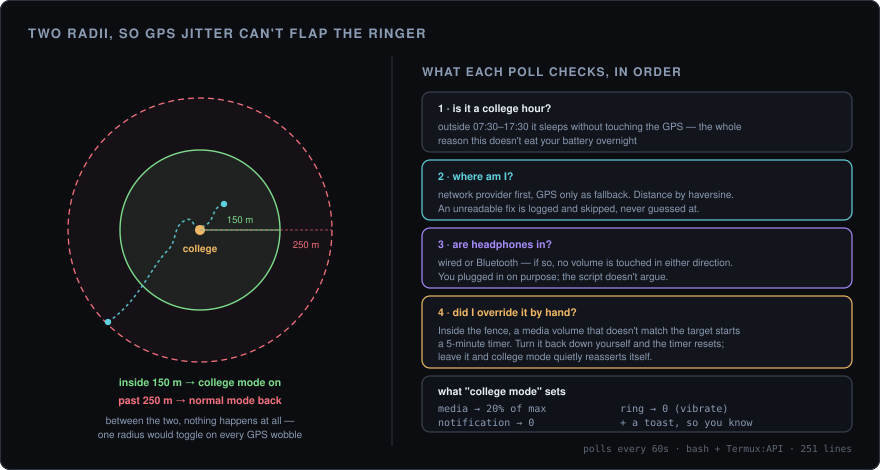

<div align="center">

# college-mode

**Your phone goes quiet when you walk into college, and loud again when you leave.**

Pure bash on Termux. No root, no paid automation app, no account.

<p>
  
  
  
  
</p>

<br />



<sub>The gap between the two circles is the entire point — one radius would toggle your ringer every time GPS wobbled.</sub>

</div>

<br />

---

## The short version

A geofence that manages your volume. Walk within 150 m of campus and your phone drops to vibrate with media at 20%. Walk 250 m away and it's back to full. In between, nothing happens — which is what stops it flapping.

It also knows when to leave you alone: outside college hours it doesn't even wake the GPS, and if you have headphones in it won't touch your volume in either direction.

---

## What it does

| Situation | Behaviour |
|---|---|
| Cross into the 150 m fence | Vibrate, media → 20%, notifications → 0, and a toast |
| Get more than 250 m away | Ringer back on, media → 100%, notifications → max |
| Drift around the boundary | Nothing. The enter and exit radii are different on purpose |
| Headphones in, wired or Bluetooth | No volume change, either direction |
| You turn the volume up inside college | Left alone for 5 minutes, then quietly set back |
| You turn it back down yourself | Timer resets, no override applied |
| Before 07:30 or after 17:30 | Sleeps without polling location at all |
| Phone reboots | Termux:Boot restarts it |
| Location unreadable | Logged and skipped — never acted on a guess |

---

## Why two radii

A single geofence at 150 m sounds fine until you sit near the edge of it. Consumer GPS drifts tens of metres at rest, so a phone parked at 148 m reads 152 m a minute later, then 147 m after that — and each crossing toggles your ringer, fires a toast, and undoes whatever you just set by hand.

So entering and leaving use different thresholds. You enter at 150 m; you don't leave until 250 m. The 100 m band between them absorbs the jitter, and the only way to cross both is to actually walk somewhere.

The same idea covers manual overrides. If you raise the volume inside college, the script notices the mismatch and starts a five-minute timer rather than immediately fighting you. Put it back yourself and the timer resets. Leave it, and college mode reasserts itself. You get to override it; you just don't get to forget.

---

## Setting it up

### 1. Install Termux, from F-Droid

[Termux](https://f-droid.org/repo/com.termux_118.apk) · [Termux:API](https://f-droid.org/repo/com.termux.api_51.apk) · [Termux:Boot](https://f-droid.org/repo/com.termux.boot_7.apk)

The Play Store builds are frozen on an old version and are missing what this needs. Sideload the three APKs, or `adb install` them.

### 2. Grant what it needs

```bash
termux-setup-storage
```

Then, in Android Settings:

- **Location** → Apps → Termux → Permissions → Location → **Allow all the time**. "While in use" is not enough for a background script.
- **Battery** → Apps → Termux → Battery → **Unrestricted**
- Open the **Termux:Boot** app once, to arm it

### 3. Dependencies

```bash
pkg install termux-api python git
```

Python is here for two small jobs: parsing the JSON that `termux-*` commands return, and the haversine distance calculation. Everything else is bash.

### 4. Point it at your college

```bash
git clone https://github.com/chakri192/college-mode.git
cd college-mode && chmod +x college_mode.sh
```

Get your coordinates from Google Maps — long-press the building, and they appear at the top. Then set them in your shell profile rather than editing the script:

```bash
cat >> ~/.bashrc << 'EOF'
export COLLEGE_LAT="12.345678"
export COLLEGE_LON="77.654321"
EOF
source ~/.bashrc
```

The defaults are `0.000000` — an island in the Atlantic — so it will do nothing at all until you set these.

### 5. Run it, and keep it running

```bash
nohup bash college_mode.sh > ~/college.log 2>&1 &
```

```bash
mkdir -p ~/.termux/boot
cat > ~/.termux/boot/college-mode.sh << 'EOF'
#!/data/data/com.termux/files/usr/bin/bash
termux-wake-lock
export COLLEGE_LAT="12.345678"
export COLLEGE_LON="77.654321"
nohup bash ~/college-mode/college_mode.sh > ~/college.log 2>&1 &
EOF
chmod +x ~/.termux/boot/college-mode.sh
```

---

## Try it without going anywhere

`TEST_MODE=1` swaps out every Termux call for a stub — fake coordinates, fake volume levels, fake headphone state — and logs what it *would* have done instead of doing it. You can test the whole state machine sitting at your desk.

```bash
# pretend you're standing on campus
TEST_MODE=1 TEST_LAT=12.345678 TEST_LON=77.654321 \
  COLLEGE_LAT=12.345678 COLLEGE_LON=77.654321 \
  CHECK_INTERVAL=2 bash college_mode.sh
```

```bash
# pretend you're on campus with headphones in — should refuse to change anything
TEST_MODE=1 TEST_HEADPHONES=1 TEST_LAT=12.345678 TEST_LON=77.654321 \
  COLLEGE_LAT=12.345678 COLLEGE_LON=77.654321 bash college_mode.sh
```

Volume changes appear as `[SIM] set music → 5` and toasts as `[TOAST] …`, so nothing on the phone is touched.

---

## Configuration

Every value is an environment variable. Nothing needs the script edited.

| Variable | Default | Meaning |
|---|---|---|
| `COLLEGE_LAT` · `COLLEGE_LON` | `0.000000` | Where campus is. **Set these** |
| `RADIUS_METERS` | `150` | Enter the fence inside this |
| `EXIT_RADIUS_METERS` | `250` | Leave it only past this. Must be larger than the above |
| `CHECK_INTERVAL` | `60` | Seconds between location polls |
| `RESET_MINUTES` | `5` | How long a manual volume override survives |
| `COLLEGE_MEDIA_PCT` | `20` | Media volume on campus, as a percentage of max |
| `COLLEGE_RINGER` | `0` | Ringer level on campus. `0` is vibrate |
| `NORMAL_RINGER_PCT` | `100` | Ringer percentage once you leave |
| `LOG_FILE` | `~/college.log` | Where the log goes |

**Test-mode variables:** `TEST_MODE`, `TEST_LAT`, `TEST_LON`, `TEST_MUSIC_VOL`, `TEST_MAX_VOL`, `TEST_HEADPHONES`, `TEST_BLUETOOTH`.

The active window, 07:30–17:30, is currently hardcoded in the main loop rather than exposed as a variable. Change the two comparisons near `HOUR=$(date +%H%M)` if your timetable differs.

---

## Watching it work

```bash
tail -f ~/college.log
```

```
[09:12:04] Coords: 12.345701, 77.654298 | Dist: 31m | In college: 0
[09:12:04] >>> Entered college (31m)
[09:12:05] Applied college mode (media=5/25, ringer=0)
[09:41:07] Volume check: current=14 target=5
[09:41:07] Volume manually changed: 14 → will revert in 5m
[09:46:09] Timer: 5/5m
[09:46:09] Reverting volume after 5m
```

```bash
pgrep -f college_mode.sh && echo running || echo stopped
pkill -f college_mode.sh
```

---

## When it misbehaves

| Symptom | Cause |
|---|---|
| Nothing in the log but `WARN: Could not get location` | Location permission is "while in use", not "all the time" |
| Dies after a few hours | Battery optimisation. Termux → Battery → Unrestricted |
| Never enters, even on campus | Coordinates still at `0.000000`, or lat/lon swapped |
| Toggles repeatedly | `EXIT_RADIUS_METERS` set at or below `RADIUS_METERS`, which removes the hysteresis |
| Volume changes ignored entirely | Headphones or a Bluetooth audio device connected — this is deliberate |
| Nothing happens all day | Outside the 07:30–17:30 window |

---

## Cost

Location polls once a minute during the active window and not at all outside it, using the network provider before GPS. In practice that's the difference between a script you keep and one you uninstall after a day of watching your battery drop.
