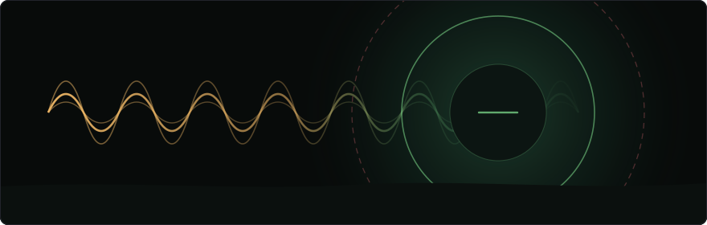

<div align="center">



# college-mode

**Your phone goes quiet when you walk into college, and loud again when you leave.**

Pure bash on Termux. No root, no paid automation app, no account.

<p>
  
  
  
  
</p>

</div>

---

Walk within 150 m of campus and your phone drops to vibrate with media at 20%. Walk 250 m away and it's back to full. In between, nothing happens — which is what stops it flapping.

It also knows when to leave you alone: outside college hours it doesn't wake the GPS at all, and if headphones are in it won't touch your volume in either direction.

| Situation | Behaviour |
|---|---|
| Cross into 150 m | Vibrate, media → 20%, notifications → 0, and a toast |
| More than 250 m away | Ringer on, media → 100%, notifications → max |
| Drift around the boundary | Nothing — the enter and exit radii differ on purpose |
| Headphones, wired or Bluetooth | No change, either direction |
| You turn it up inside college | Left alone 5 minutes, then quietly set back |
| Before 07:30 or after 17:30 | Sleeps without polling location |

## Why two radii

A single 150 m geofence sounds fine until you sit near its edge. Consumer GPS drifts tens of metres at rest, so a phone parked at 148 m reads 152 m a minute later and 147 m after that — and each crossing toggles your ringer, fires a toast, and undoes whatever you just set by hand.

So entering and leaving use different thresholds. You enter at 150 m; you don't leave until 250 m. The band between absorbs the jitter, and the only way to cross both is to walk somewhere.

The same idea covers manual overrides. Raise the volume inside college and the script starts a five-minute timer rather than immediately fighting you. Put it back yourself and the timer resets. Leave it, and college mode reasserts itself. You get to override it; you just don't get to forget.

## Setting it up

**1. Termux, Termux:API and Termux:Boot, from F-Droid.** The Play Store builds are frozen and missing what this needs.

[Termux](https://f-droid.org/repo/com.termux_118.apk) · [Termux:API](https://f-droid.org/repo/com.termux.api_51.apk) · [Termux:Boot](https://f-droid.org/repo/com.termux.boot_7.apk)

**2. Permissions.** Location → **Allow all the time** (not "while in use" — that's not enough for a background script), Battery → **Unrestricted**, and open Termux:Boot once to arm it.

**3. Dependencies.** `pkg install termux-api python git` — Python is only there to parse the JSON that `termux-*` returns, and for the haversine.

**4. Coordinates.** From Google Maps, long-press the building. Set them in your shell profile rather than editing the script:

```bash
export COLLEGE_LAT="12.345678"
export COLLEGE_LON="77.654321"
```

The defaults are `0.000000` — an island in the Atlantic — so nothing happens until you set these.

**5. Run it, and survive a reboot:**

```bash
nohup bash college_mode.sh > ~/college.log 2>&1 &
```

Put the same two exports plus `termux-wake-lock` in `~/.termux/boot/college-mode.sh`.

## Try it without going anywhere

`TEST_MODE=1` swaps every Termux call for a stub — fake coordinates, fake volumes, fake headphone state — and logs what it *would* have done.

```bash
TEST_MODE=1 TEST_LAT=12.345678 TEST_LON=77.654321 \
  COLLEGE_LAT=12.345678 COLLEGE_LON=77.654321 \
  CHECK_INTERVAL=2 bash college_mode.sh
```

Add `TEST_HEADPHONES=1` to check it refuses. Volume changes appear as `[SIM] set music → 5`; nothing on the phone is touched.

## Configuration

| Variable | Default | Meaning |
|---|---|---|
| `COLLEGE_LAT` · `COLLEGE_LON` | `0.000000` | **Set these** |
| `RADIUS_METERS` | `150` | Enter inside this |
| `EXIT_RADIUS_METERS` | `250` | Leave only past this — must be larger |
| `CHECK_INTERVAL` | `60` | Seconds between polls |
| `RESET_MINUTES` | `5` | How long a manual override survives |
| `COLLEGE_MEDIA_PCT` | `20` | Media volume on campus, % of max |
| `COLLEGE_RINGER` | `0` | `0` is vibrate |
| `NORMAL_RINGER_PCT` | `100` | Ringer % once you leave |

Test-mode: `TEST_MODE`, `TEST_LAT`, `TEST_LON`, `TEST_MUSIC_VOL`, `TEST_MAX_VOL`, `TEST_HEADPHONES`, `TEST_BLUETOOTH`.

The 07:30–17:30 window is hardcoded in the main loop — change the comparisons near `HOUR=$(date +%H%M)` if your timetable differs.

## Watching it

```bash
tail -f ~/college.log
```

```
[09:12:04] Coords: 12.345701, 77.654298 | Dist: 31m | In college: 0
[09:12:04] >>> Entered college (31m)
[09:41:07] Volume manually changed: 14 → will revert in 5m
[09:46:09] Reverting volume after 5m
```

| Symptom | Cause |
|---|---|
| Only `WARN: Could not get location` | Location permission is "while in use" |
| Dies after a few hours | Battery optimisation |
| Never enters | Coordinates still `0.000000`, or lat/lon swapped |
| Toggles repeatedly | `EXIT_RADIUS_METERS` at or below `RADIUS_METERS` |
| Nothing happens at all | Outside the 07:30–17:30 window |
